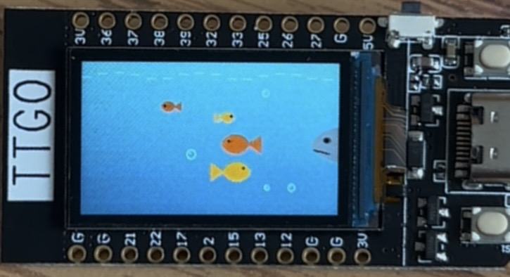

# Ocean Generative Art

This is an interactive design of generative art built with an ESP32 and a TFT display. The display resembles the ocean inside a small aquarium exhibit ticket, which includes colorful fish swimming through the water, rising bubbles, and a shark that enters the scene periodically.

## My Vision

I wanted to create a small underwater environment that felt calm and playful but still had its moment of surprise. I designed the physical installation as an aquarium ocean exhibit ticket made from a paper envelope. The cutout in the ticket frames the TFT display, making the screen feel like a window into the ocean. The idea was for the viewer to feel like they were looking through an aquarium ticket and seeing a glimpse of a small underwater world inside it.

I wanted the animation to feel like a living ecosystem rather than just objects moving randomly. The fish are randomized in size, colors, and speeds, and bubbles rise slowly to the surface. Periodically, a shark swims by and scares the fish, causing them to instantly turn around and swim away much faster. Once the shark exits the screen, the fish reset to their default behavior, and the calm underwater environment continues.

## How It Works

The animation is programmed in Arduino using the TFT_eSPI and SPI libraries. The TFT display is updated continuously using a sprite buffer, allowing the ocean, fish, bubbles, and shark to move smoothly.

The background uses a blue gradient that starts lighter near the top and becomes darker toward the bottom to create the feeling of depth. Small wave lines at the top of the screen also move slightly over time.

Four fish are generated with different random sizes, positions, colors, and speeds. They normally swim across the screen and wrap around when they reach the edge. When the shark gets close, it scares the fish, and they turn around and swim away faster.

Six bubbles slowly move upward at different positions and sizes. When a bubble reaches the top of the screen, it is placed back near the bottom at a new random position.

The shark waits for a period of time before entering from the right side of the screen and swimming toward the left. Once the shark leaves the screen, the fish are regenerated, and the ocean returns to its normal state.

## Materials + Setup

- ESP32
- TFT display
- LiPo battery
- Paper envelope
- Tape
- Drawing/coloring materials
- Arduino IDE
- TFT_eSPI library
- SPI library

The TFT display is placed behind a cutout in the paper envelope so that the screen becomes the ocean portion of the aquarium ticket. The ESP32 and battery are kept behind the envelope, while the front is decorated to look like an aquarium ocean exhibit ticket.

To recreate my project, open ocean_generative_art.ino in the Arduino IDE, install the required TFT_eSPI and SPI libraries, select ESP32 Dev Module as the board, and upload the code. Once the ESP32 is connected using a USB-C cable, the animation begins automatically.

## Final Design

## Installation Photos

## Code

The complete Arduino code used for the installation is included in this repository in `ocean_generative_art.ino`.
